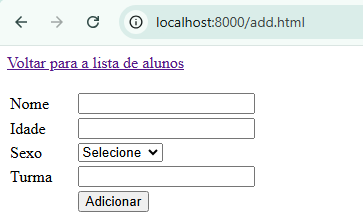

# Projeto CRUD de Alunos

## Funcionalidades
- **Criar alunos:** Inserção de novos alunos no banco de dados.
- **Listar alunos:** Exibição da lista de alunos cadastrados.
- **Editar alunos:** Atualização dos dados de um aluno.
- **Excluir alunos:** Remoção de um aluno do sistema.

### Index


### add.html


## Tecnologias Utilizadas
- **PHP:** Para o backend e manipulação dos dados.
- **HTML e JavaScript:** Para a interface do usuário e interatividade.
- **MongoDB:** Banco de dados NoSQL utilizado para armazenar as informações dos alunos.

## Estrutura do Projeto
```
projeto/
│── config.php        # Configuração do banco de dados
│── index.php         # Página inicial - lista de alunos
│── add.php           # Página para adicionar alunos
│── edit.php          # Página para editar alunos
│── delete.php        # Página para excluir alunos
└── README.md         # Documentação do projeto
```